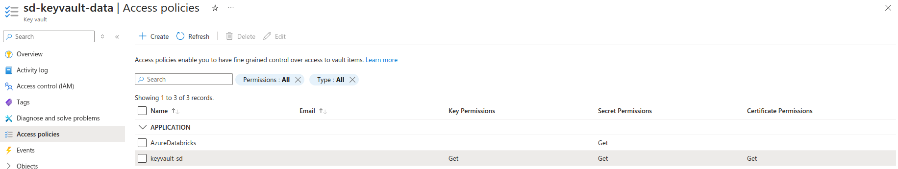
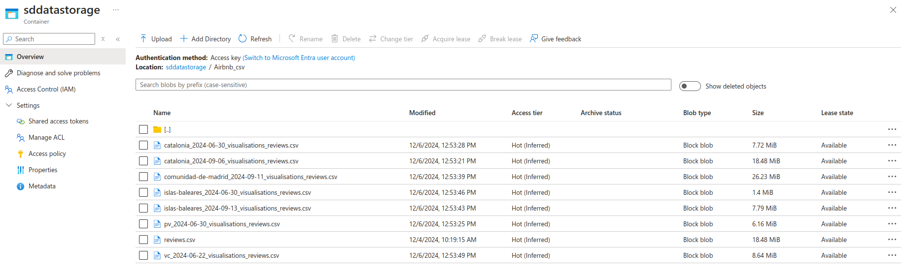

Pour créer les ressources :
```
terraform init 
terraform apply -var-file="terraform.tfvars"
```

Dans le fichier terraform.tfvars :
```
resource_group_name     = "RG_SDELVAL"
resource_group_location = "francecentral"
data_lake_name          = "sdelvaldatalake"
dl_filesystem_name      = "sddatastorage"
```

Cela permet de créer un groupe de ressources et un Data Lake avec un conteneur contenant deux répertoires.
Via le portail, je crée dans l'Entra ID 2 app registration (Service principal) nommés **dl-sas-read-sd** et **keyvault-sd**.
Puis, je crée un Key Vault.

Je crée les secrets pour se connecter aux services principaux. Celui de **dl-sas-read-sd** sera stocké dans le Key Vault et celui de **keyvault-sd** dans le fichier .env.

Dans l'IAM du Data Lake, je donne le rôle de "Storage Data Delegator and Writer" au service principal **dl-sas-read-sd**, afin que celui-ci puisse générer des SAS.

Dans les Access Policies, je donne uniquement la permission au service principal **keyvault-sd** de récupérer les clés, secrets et certificats.
Capture d'écran des Access Policies :


Dans le fichier .env :
```
SP_ID_SECONDARY="YOUR SP_ID_SECONDARY"
SP_SECONDARY_PASSWORD="YOUR SP_SECONDARY_SECRET"
SP_ID_PRINCIPAL="YOUR SP_ID_PRINCIPAL"
TENANT_ID="YOUR TENANT_ID"
KEYVAULT_URL="YOUR KEYVAULT_URL"
SECRET_NAME="YOUR SECRET_NAME"
STORAGE_ACCOUNT_NAME="sdelvaldatalake"
FILE_SYSTEM_NAME="sddatastorage"
AIRBNB_DIR_NAME="Airbnb_csv"
HUGGING_FACE_DIR_NAME="Hugging_Face_parquet"
```

Capture d'écran du Data Lake après l'exécution du script :
