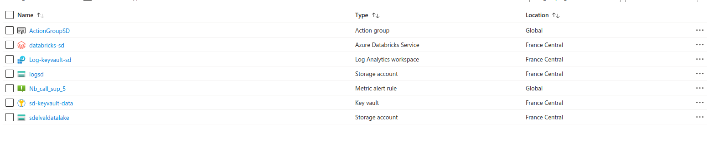

# brief_data_lake

## Contexte Fictif
En tant que **Data Ingénieur** au sein de l’entreprise **DataMoniSec**, vous êtes chargé de mettre en place une infrastructure de données robuste et sécurisée sur **Microsoft Azure**. Votre mission s’articule de la **sécurité** et du **monitoring** du data lake.

Votre mission est de :
- Configurer un Data Lake pour centraliser les données de l'entreprise.
- Ingérer des données provenant de différentes sources.
- Mettre en place des mesures de sécurité avancées pour protéger les données sensibles.
- Configurer Azure Databricks pour permettre à l'équipe Data Science d'analyser les données.
- Implémenter un système de monitoring et d'alertes pour surveiller l'infrastructure.

## Partie 1 : Veille sur les Systèmes de Sécurité

### Objectif

Acquérir une **vision panoramique** des méthodes de sécurité disponibles sur Azure pour protéger les données dans un Data Lake. Je ne vous demande pas d’être un expert sur chacun de ces éléments mais d’avoir une intuition de comment ça marche et de pouvoir décrire en une phrase ce que fait chaque service.

### [Rendue](Partie1_Veille_Systemes_Securite/Concepts_important.md)

## Partie 2 : Création et ingestion sécurisée sur le data lake

### Objectif
L’objectif de cette partie est de créer des scripts Python pour stocker des données dans un Azure Data Lake Storage Gen 2 de manière sécurisée. Vous allez vous concentrer sur la gestion des identités et des secrets en utilisant des outils comme Azure Key Vault, tout en pratiquant les concepts de sécurité avec Azure.

### [Rendue](Partie2_Creation_ingestion_securisee_data_lake/rendue.md)

## Partie 3 : Configuration d'Azure Databricks

### **Objectif**

Configurer Azure Databricks pour permettre à l'équipe Data Science d'analyser les données, tout en mettant en œuvre les mesures de sécurité appropriées.

### [Rendue](Partie3_Azure_Databricks/rendue.md)

## Partie 4 : Monitoring et Alertes

### **Objectif**

Mettre en place un système de monitoring et d'alertes pour surveiller le Data Lake et être en mesure de réagir rapidement en cas d'incidents.

L’objectif de cette partie est de découvrir `Logs Analytics`, `Activity logs`, `Metrics`, `insights` et `Alerts`. Ce sont des services que vous pouvez atteindre de différentes façons. Par exemple, dans votre `storage account`, il y a un section `monitoring` avec ces services pré-configurés pour surveiller votre instance de `storage account`. Vous pouvez également utiliser ces services de maniére indépendante, en faisant par exemple une recherche `Metrics` dans la barre de recherche. Ou enfin vous pouvez les utiliser via le service unifié `Monitor`.

### [Rendue](Partie4_Monitoring_Alertes/rendue.md)

# Contenu du groupe de ressources
